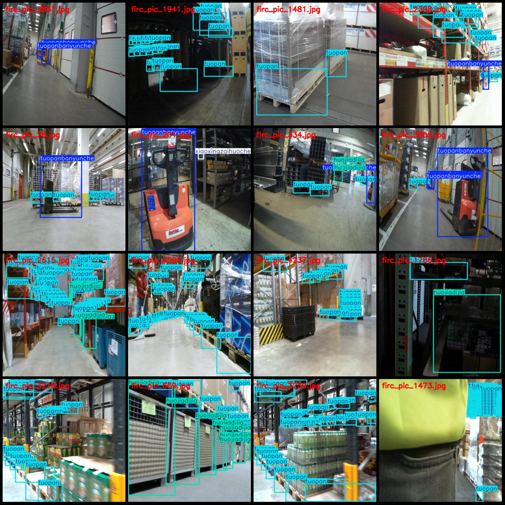
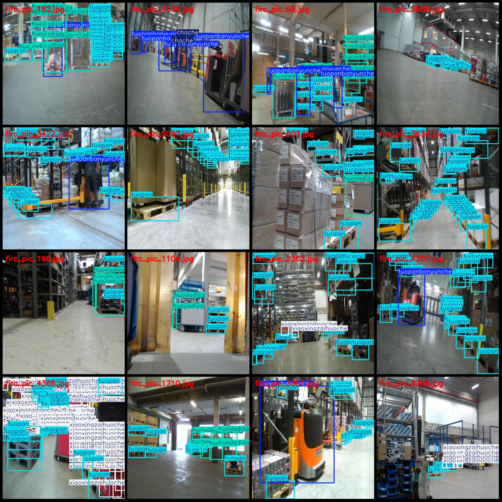

# Storage Materials Detection Data Set, VOC+YOLO format, 5091 categories

The dataset format is Pascal VOC with YOLO. It does not include a split path in the txt file but only contains JPG images along with corresponding VOC XML files and YOLO txt files. There are 5091 
images (JPG files), 5091 annotations (XML files), and 5091 annotation files (txt files). The number of categories is 5.

The dataset follows the following format:
- Image sizes: 416x416
- Number of images: 5091
- Number of annotations: 5091
- Number of annotation files: 5091
- Number of categories: 5
- Annotation file names: ["chache", "huojiadijia", "tuopan", "tuopanbanyunche", "xiaoxingzaihuoche"]
- Corresponding Chinese category names: ["Forklift", "Shelf/Baseframe", "Pallet", "Pallet truck", "Small truck"]
- Box counts for each category:
  - chache box count = 596
  - huojiadijia box count = 5379
  - tuopan box count = 120138
  - tuopanbanyunche box count = 2825
  - xiaoxingzaihuoche box count = 22120
  Total box count = 151058
- Box counts per category:
  - chache box count = 447
  - huojiadijia box count = 1108
  - tuopan box count = 4721
  - tuopanbanyunche box count = 1501
  - xiaoxingzaihuoche box count = 1101
Image resolution: 416x416
Annotation tools used: labelImg
Annotation rules: draw boxes around categories
Special notice: The dataset does not have a training validation test split, so users need to divide it themselves.
Special declaration: This dataset does not guarantee the accuracy of the trained models or weight files.
Image previews can be found here.
## Images

Here is a pay link on Stripe ( https://buy.stripe.com/3cs8yP7sY87d0vu9AB ). Please contact me lonlonago@foxmail.com after funding $89, and I will send you a complete data files , thank you!

